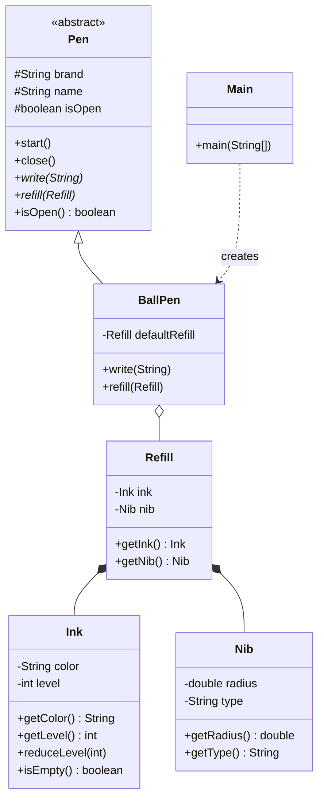

# Pen LLD - Class Diagram

```mermaid
classDiagram
    class Pen {
        <<abstract>>
        #String brand
        #String name
        #boolean isOpen
        +start()
        +close()
        +write(String)*
        +refill(Refill)*
        +isOpen() boolean
    }

    class BallPen {
        -Refill defaultRefill
        +write(String)
        +refill(Refill)
    }

    class Refill {
        -Ink ink
        -Nib nib
        +getInk() Ink
        +getNib() Nib
    }

    class Ink {
        -String color
        -int level
        +getColor() String
        +getLevel() int
        +reduceLevel(int)
        +isEmpty() boolean
    }

    class Nib {
        -double radius
        -String type
        +getRadius() double
        +getType() String
    }

    class Main {
        +main(String[])
    }

    Pen <|-- BallPen
    BallPen o-- Refill
    Refill *-- Ink
    Refill *-- Nib
    Main ..> BallPen : creates
```
