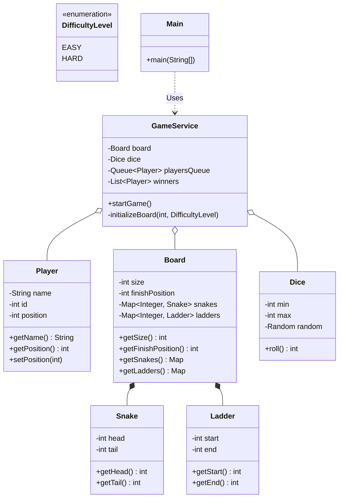

# Snakes and Ladders - Class Diagram

```mermaid
classDiagram
    class Player {
        -String name
        -int id
        -int position
        +getName() String
        +getPosition() int
        +setPosition(int)
    }

    class Snake {
        -int head
        -int tail
        +getHead() int
        +getTail() int
    }

    class Ladder {
        -int start
        -int end
        +getStart() int
        +getEnd() int
    }

    class Board {
        -int size
        -int finishPosition
        -Map~Integer, Snake~ snakes
        -Map~Integer, Ladder~ ladders
        +getSize() int
        +getFinishPosition() int
        +getSnakes() Map
        +getLadders() Map
    }

    class Dice {
        -int min
        -int max
        -Random random
        +roll() int
    }

    class DifficultyLevel {
        <<enumeration>>
        EASY
        HARD
    }

    class GameService {
        -Board board
        -Dice dice
        -Queue~Player~ playersQueue
        -List~Player~ winners
        +startGame()
        -initializeBoard(int, DifficultyLevel)
    }

    class Main {
        +main(String[])
    }

    Board *-- Snake
    Board *-- Ladder
    GameService o-- Board
    GameService o-- Dice
    GameService o-- Player
    Main ..> GameService : Uses
```
